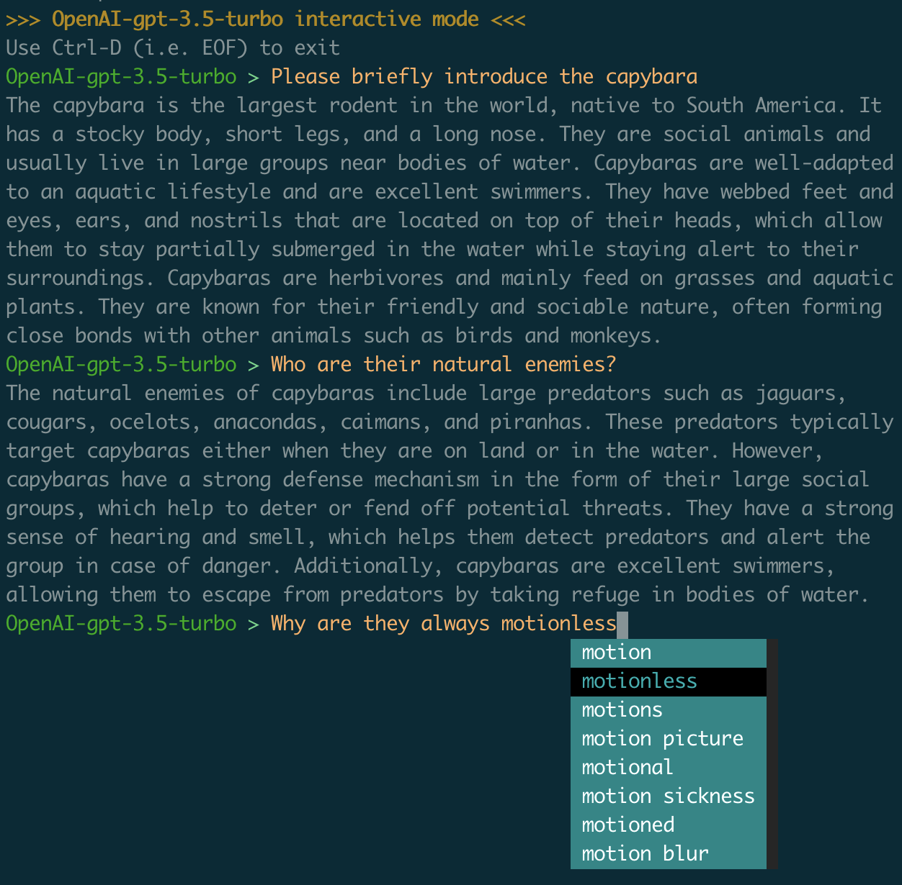

# Dict-tiny

[](https://pypi.python.org/pypi/dict-tiny/) [](https://github.com/louieh/dict-tiny/actions?query=workflow%3A%22Upload+Dict-tiny+Python+Package%22) [](https://opensource.org/licenses/MIT) [](https://pepy.tech/project/dict-tiny)

A command-line tool that integrates Youdao Dict, Google Translate, ~~DeepL Translator~~, Gemini and OpenAI. 

Just for fun :)


## Features

* youdao.com.
* Google Translate API.
* Gemini.
* OpenAI.
* Use the above features in interactive mode.

<p align="center"></p>

## Installing

Install with `pip`. (Python >= 3.9)

```bash
$ pip install dict-tiny
```


## Upgrading

```bash
$ pip install --upgrade dict-tiny
```


## Options

```bash
$ dict-tiny

Usage:
    dict-tiny [SWITCHES] words...

Gemini:
    --gemini                        Use Gemini API
    --gemini-key VALUE:str          Indicate gemini api key
    --gemini-model VALUE:str        Select gemini model; the default is gemini-
                                    pro
    --img-path VALUE:ExistingFile   The path of image

GoogleTranslate:
    --detect-language               Detect the language of the given text
    -g, --google                    Use Google Translate

LLM:
    --dialog-turns VALUE:[1..20]    Number of conversations turns; the default
                                    is 10
    --max-output-tokens VALUE:int   The maximum number of tokens to include in a
                                    candidate.
    --temperature VALUE:float       Controls the randomness of the output

Meta-switches:
    -h, --help                      Prints this help message and quits
    --help-all                      Prints help messages of all sub-commands and
                                    quits
    -v, --version                   Prints the program's version and quits

OpenAI:
    --api-version VALUE:str         Azure openai api version
    --azure-base-url VALUE:str      Azure openai base url
    --azure-endpoint VALUE:str      Azure endpoint
    --openai                        Use OpenAI API
    --openai-key VALUE:str          Indicate openai api key
    --openai-model VALUE:str        Select openai model; the default is
                                    gpt-3.5-turbo

Switches:
    -c, --clipboard                 Use the contents of the clipboard.
    --default-translator VALUE:str  Set default translator
    -i, --interactive               Interactive mode
    --source-language VALUE:str     What language you want to translate
    --target-language VALUE:str     What language you want to translate into

YoudaoDict:
    -m, --more                      Get more details
    -y, --youdao                    Use Youdao Dictionary, currently only
                                    supports English or Chinese words
```


## Details and examples

### Youdao Dict

Add `-y` / `--youdao` to use Youdao Dict:

You can use youdao for Chinese-English, Chinese-Japanese, Chinese-French, and Chinese-Korean translation. The default is Chinese-English translation.

```bash
$ dict-tiny -y book

>>> YoudaoDict <<<
book
======
[美]bʊk [英]bʊk

n. 书，书籍；本子，簿册；（长篇作品的）篇，卷，部；装订成册之物；赌局，打赌；账册，账簿
v. 预订，预约；（警方）将……记录在案；（裁判）记名警告
 【名】 （Book）（英）布克，（瑞典）博克，（朝）北（人名）
复数: books, 第三人称单数: books, 现在分词: booking, 过去式: booked, 过去分词: booked
```

```bash
$ dict-tiny -y 书

>>> YoudaoDict <<<
书
===
shū

book
书，书籍；本子，簿册；（长篇作品的）篇，卷，部；装订成册之物；赌局，打赌；账册，账簿；预订，预约；（警方）将……记录在案；（裁判）记名警告；【名】 （Book）（英）布克，（瑞典）博克，（朝）北（人名）；

write
写作，编写；写道；写信；书写，写字；谱写（音乐作品）；编写（计算机程序）；将（计算机中的）数据写入（磁盘或其他储存媒体）；填写（表格、支票等），拟定；（笔）能写字；拼写；<加，南非>参加（笔试）；书写，手写（与铅印相对）；以写作为生；承保（保险单）；

letter
信，信函；字母；<美>（缝制在运动服上的）校运动队首字母标志；<英，非正式>（代表学位或职位等资格的）首字母缩略词（letters）；文学；法律文书，正式文书（letters）；字面确切含义；（印刷）一种铅字字体；<古> 学识，渊博的学问；用字母标注；把字母印刷（或缝制等）于；<美>赢得学校运动队的字母标志；【名】 （Letter）（美、英、巴西）莱特（人名）；

script
剧本，讲稿；笔迹，手写体；连写体，草体；字体；（一种语言的）字母系统，字母表；<英>（考生的）笔试答卷； 脚本（程序）（计算机的一系列指令）；<非正式>（医生的）处方；期待，计划；写剧本，写讲稿；事先准备，计划；

```

Use `-m` / `--more` to get more detail translation for the word:

```bash
$ dict-tiny -y 曾经 -m

>>> YoudaoDict <<<
曾经
====
céng jīng

once
一次， 一回；曾经，一度；任何一次，从来；乘以一；一.....就， 一旦；一次；

ever
曾经，从来，在任何时候；一直，始终；越来越，愈发；究竟，到底；非常，确实；【名】 （Ever）（英）埃弗，（俄）叶韦尔，（西、法）埃韦尔（人名）；


📖 wuguanghua:
(表示有过某些行为或情况) once

 例: He once lived in Shanghai.
     他曾经在上海住过。
 例: She has taken part in a major battle for oil.
     她曾经参加过石油大会战。
 例: I have seen him before.
     我曾经见到过他。
```

```bash
$ dict-tiny -y dictionary -m

>>> YoudaoDict <<<
dictionary
============
[美]ˈdɪkʃəneri [英]ˈdɪkʃən(ə)ri

n. 字典，词典；专业词典，术语大全；电子词典；双语词典
复数: dictionaries

📖 collins:
dictionary/ˈdɪkʃənərɪ
======== N-COUNT 可数名词 ========
A dictionary is a book in which the words and phrases of a language are listed alphabetically, together with their meanings or their translations in another language. 词典
 例: ...a Spanish-English dictionary.
     …一本西班牙语—英语词典。
```

Specify `--target-language` to translate to other languages.

```bash
$ dict-tiny -y 进击的巨人 --target-language ja

>>> YoudaoDict <<<
进击的巨人
=======
jinjidejuren

進撃の巨人（しんげきのきょじん）（日本漫画家谏山创创作的少年漫画作品，于2009年在讲谈社旗下的漫画杂志《别册少年》上开始连载。）
```

```bash
$ dict-tiny -y Bonjour --target-language fr

>>> YoudaoDict <<<
Bonjour
=========
bɔ̃ʒu:r

[m.]
早安，日安，白天好，你好
```

```bash
$ dict-tiny -y go는 구글이 만든 오픈 소스 프로그래밍 언어이다 --target-language ko

>>> YoudaoDict <<<
go는 구글이 만든 오픈 소스 프로그래밍 언어이다
=============================
go是谷歌开发的开源程序设计语言
```


### Google Translate

Add `-g` / `--google` to use Google Translate:

```bash
$ dict-tiny -g book

>>> GoogleTranslate <<<
book
======
output: 书
detected language: en
```

Add `--target-language` to specify the language to translate results into：

```bash
$ dict-tiny -g operation system --target-language ja

>>> GoogleTranslate <<<
operation system
==================
output: オペレーションシステム
detected language: en
```

Add `--source-language` to specify the language of the text to be translated, but in most cases you don't need to do this because the google translate api automatically detects the source language type. 

And if you give a wrong source language, the translation result may not be what you expect.

So, of course, you can add `--detect-language` to detect the language type:

```bash
$ dict-tiny -g --detect-language español

>>> GoogleTranslate <<<
español
=========
confidence: 0.49805447459220886
input: español
language: es
name: Spanish
```

**Note:**

* Make sure Google services are available in your network environment.

* The source and target languages for Google Translate are identified using the [iso-639-1](https://en.wikipedia.org/wiki/List_of_ISO_639-1_codes) codes. 

  ```bash
  $ dict-tiny -g book --target-language zh --source-language en
  
  >>> GoogleTranslate <<<
  book
  ======
  output: 书
  source language: en
  ```

  You can also enter the ISO language name:

  ```bash
  $ dict-tiny -g book --target-language German --source-language English
  
  >>> GoogleTranslate <<<
  book
  ======
  output: Buch
  source language: English
  ```

* Set the environment variable `$DICT_TINY_TARGET_LAN` so that you do not have to manually specify the target language each time. if you specify the target language parameter on the command line with `--target-language`, the setting in the environment variable will be overwritten.
* The default `target-language` is `Chinese` .

### Gemini

Add `--gemini` to use Gemini.

Use `--gemini-model` to specify the model used by Gemini. You can also set the environment variable `$DICT_TINY_GEMINI_MODEL`. The default model is `gemini-pro`.

Use `--gemini-key` to specify the Gemini api key, or set the environment variable `$DICT_TINY_GEMINI_API_KEY`.

**Note:**

* If you use `gemini-pro-vision` model, you need to use `--img-path` to specify the path of image.

* Use `--max-output-tokens` to specify the maximum output token.

* Use `--temperature` to specify the temperature.

### OpenAI

Add `--openai` to use OpenAI.

Use `--openai-model` to specify the model used by OpenAI. You can also set the environment variable `$DICT_TINY_OPENAI_MODEL`. The default model is `gpt-3.5-turbo`.

Use `--openai-key` to specify the OpenAI api key, or set the environment variable `$DICT_TINY_OPENAI_API_KEY`.

```bash
$ dict-tiny --openai who are you?

>>> OpenAI-gpt-3.5-turbo <<<
I am an AI language model created by OpenAI. I can assist you with various tasks, answer questions, and
engage in conversations on a wide range of topics. How may I assist you today?
```

**Note:**

* Currently only text generation models are supported.

* Use `--max-output-tokens` to specify the maximum output token.

* Use `--temperature` to specify the temperature.

### Interactive mode

Each of the above functions can be entered into its interactive mode by adding the `-i` . <kbd>Ctrl</kbd> + <kbd>d</kbd> to exit interactive mode.

In interactive mode you can:

* Use above features in a continuous interactive manner.
* Press <kbd>Tab</kbd> for word auto-completion (using Youdao's auto-completion function, currently only supports Chinese, English, French, Korean, Japanese. For Japanese, Korean and French auto-completion you need to specify the `--sourge-language` parameter.)
* For Gemini and OpenAI, the dialog context is maintained in interactive mode, use `--dialog-turns` to specify the number of dialog turns to maintain, the default is 10.
* All settings cannot be changed after entering interactive mode, such as target-language, model, img-path, temperature, etc., unless you exit to change the settings and re-enter.

### Other

#### Default behavior

* Youdao Dict is the default translator, which means Youdao Dict will be used when no translator is specified.

  ```bash
  $ dict-tiny 机器学习
  
  >>> YoudaoDict <<<
  机器学习
  ======
  machine learning
  ```
  
  You can use the environment variable `$DICT_TINY_DEFAULT_TRANS` to set the default translator. There are four options described above: `YoudaoDict`, `GoogleTranslate`, `Gemini`, `OpenAI`.  Case insensitive.
* For Youdao Dict and Google translate, if the target language is not specified, Chinese and English will be used as the target language for each other.
* In non-interactive mode, multiple translators can be specified at the same time, for example, YoudaoDict and GoogleTranslate can be used at the same time.

  ```bash
  $ dict-tiny formulation -y -g
  
  >>> YoudaoDict <<<
  formulation
  =============
  英[ˌfɔːmjuˈleɪʃ(ə)n]美[ˌfɔːrmjuˈleɪʃ(ə)n]
  n. （政策、计划等的）制定，构想；（想法的）阐述方式，表达方法；（药品或化妆品的）配方，配方产品
  >>> GoogleTranslate <<<
  formulation
  =============
  output: 公式
  detected language: en
  ```

#### Use clipboard content

Use `-c`/`--clipboard` to use the contents of the clipboard:

```bash
$ dict-tiny -c -y

>>> YoudaoDict <<<
encounter
===========
英[ɪnˈkaʊntə(r)]美[ɪnˈkaʊntər]
v. 遭遇；偶遇，邂逅
n. 偶遇，邂逅；经历，体验；冲突；比赛，交锋
```

**Note:**

* `-c`/`--clipboard` has low priority. If you add `-c` and a word at the same time, the switch `-c` will be ignored.

### Environment variables

| name                       | default       | description                                                  |
| -------------------------- | ------------- | ------------------------------------------------------------ |
| `DICT_TINY_TARGET_LAN`     | en            | Specify the target language to be used in Google translate.  |
| `DICT_TINY_DEFAULT_TRANS`  | youdaodict    | Specify the default translator.<br>`youdaodict` `googletranslate` `gemini` `openai` |
| `DICT_TINY_GEMINI_MODEL`   | gemini-pro    | Specify the model to be used in the Gemini.                  |
| `DICT_TINY_GEMINI_API_KEY` |               | Specify Gemini API key.                                      |
| `DICT_TINY_OPENAI_MODEL`   | gpt-3.5-turbo | Specify the model to be used in the OpenAI.                  |
| `DICT_TINY_OPENAI_API_KEY` |               | Specify OpenAI API key.                                      |

 


## License

[MIT](https://github.com/louieh/dict-tiny/blob/master/LICENSE)
